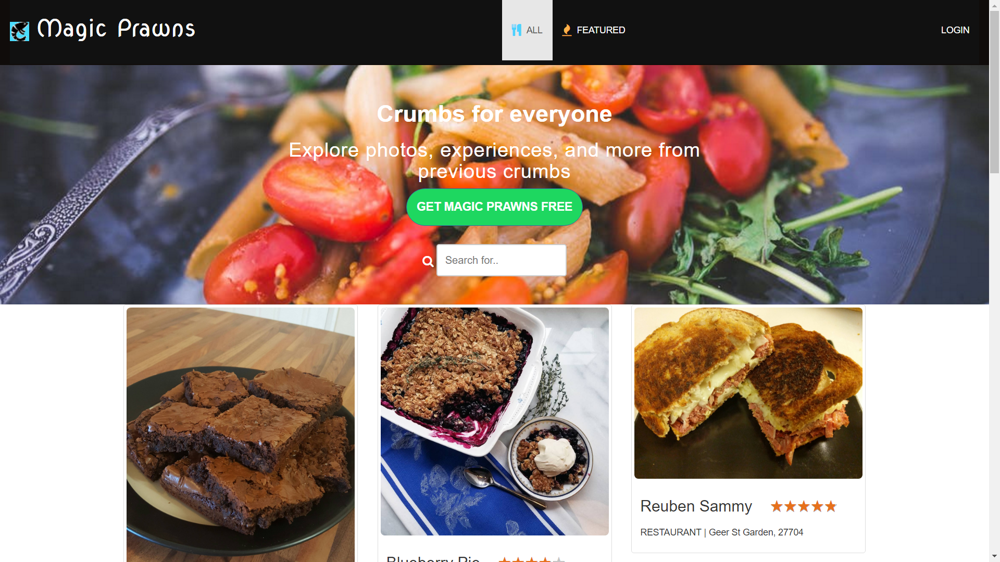

# Crumbs - Conquer the Entree Envy
 An application to help you recall that "great dish" you had at this restaurant. A personal repository of all the meals that tickled your taste buds!
 
## Contents
* [Technologies](#technologies)
* [Features](#features)
* [Getting Started](#install)

## Screenshots


## <a name="technologies"></a>Technologies

Backend: Node.JS, Express, Express-Handlebars, MySQL, Sequelize, Passport, BCryptJS<br/>
Frontend: JavaScript, jQuery,Bootstrap, HTML5, SASS<br/>

## <a name="features"></a>Features



This Crumbs application has a home page with a sign up button to register new users and a Login button for registered users to Login to the application.<br>
The home page is the ALL tab, which displays all the Dishes in the MySQL database, in no particular order. The FEATURED tab displays all the dishes from the Mysql database orderd by ratings. <br>
All users can search for a Dish or a restaurant using the search form on the home page.


The login form has a link to redirect users to the Sign up page if they haven't registered. It also has a link to return to the Home page.<br>


After the user logs in, a page utilizing Sequelize queries displays the user's saved dishes, and a Nav link to create new dishes<br>

Logged in users can search through their saved meals using the search form.<br>


When a logged-in user clicks the +New Nav link, it displays a form that takes in the Meal details. When the user hits "Save" button on the form, the form is submitted , the server validates the inputs, and if there is no error adds the Meal to the database. The API then renders the Saved page with the new meal for the user to view. 


## <a name="install"></a>Getting Started

These instructions will get you a copy of the project up and running on your local machine for development and testing purposes.

### Prerequisities

What to install and how for local development and testing purposes

```
- node.js: visit node.js and download...
- mysqldb: Got to https://www.mysql.com/ and install mysql, create database dishes_db in your local connection
- setup config.json to match your local mysqldb
- run: npm install --> to install all the dependencies
- 
```
Clone or fork this repo:

```
https://github.com/mullun/magic-prawns.git
```

Set up the database and create the database "dishes_db" in MySQL

Run the app:

```
node server
```

You can now navigate to 'localhost:8080/' to access Crumbs.

## Built With

* Sublime Text


## Authors

* **Jincy George** - *Initial work* - [Jincy George](https://github.com)
* **James** - *Initial work* - [Jincy George](https://github.com)
* **Max** - *Initial work* - [Jincy George](https://github.com)
* **Guru** - *Initial work* - [Jincy George](https://github.com)


## License

This project is licensed under the MIT License - see the [LICENSE.md](LICENSE.md) file for details

## Acknowledgments

* Hat tip to Zach Reed for the percentage based star ratings


